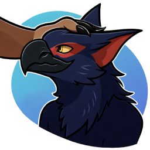

## Movement Reactive ASMR Sounds System

Realistic petting in VRChat

### Description

Movement reactive petting sounds. Smoothly fade in and out of petting sounds while moving hands in VR for enhanced meditation/ASMR experiences.

## Marketplace

https://python1320.gumroad.com/l/vrpets

### Includes
 
 - Installation instructions
 - VRCFury prefab
 - Petting sounds
 - Open source utility application (needed for volume control)

**NOT YET COMPATIBLE WITH QUEST**

### Requirements

 - **Your custom avatar** (and source code). Used [example](https://drive.google.com/drive/folders/1ekIiFBnzJNhH2a6wwYLo2s5G-VuUlIY5)
 - **SteamVR** (**NOT YET COMPATIBLE WITH QUEST**)
 - **VR controllers**
 - **Windows only** *(Author cannot presently run Linux VR due to old PC troubles)*
 - **VRChat** (ChilloutVR should also work, but is not documented and probably no longer needed. Resonite also does not need this addon.)
 - **Knowledge about [OSC](https://docs.vrchat.com/docs/osc-overview)**
 - **[Unity editor](https://creators.vrchat.com/sdk/current-unity-version/)** for avatars 
 - **[VRCFury](https://vrcfury.com/getting-started)**

### Test Avatar

https://vrchat.com/home/avatar/avtr_6f59f68e-989e-42a1-8435-25c26d09a841

### Installation Video

 - [Using VRCFury prefab assets in Unity](https://www.youtube.com/watch?v=QDvzfLa82yI)

### Installation Instructions

The steps are mostly the same as here https://morghus.gumroad.com/l/cugahoodie (replace with vr_asmr_petting.unitypackage)

**Unity**

 1. Install [VRCFury](https://vrcfury.com/getting-started)
 2. Download the gumroad `vrpets` package and extract it
 3. TAKE A BACKUP OF YOUR AVATAR HERE
 4. Import the downloaded `.unitypackage`: 
   - double click the package
   - ... or in Unity: Menu Assets -> Import Package -> Custom Package
 5. Drag the imported prefab into the scene
   - Locate the vrpets directory in the Project tab, within you'll find a "vrpets" object. 
      - Click and drag it onto the main Avatar object in your Hierarchy. It should be a direct child of the object.
	  - Once the prefab has been put in the correct place, it should show up on your avatar in the Scene view.
	  - The package includes a script that will automatically setup sounds to correct hand bones. No manual setup should be necessary.
      - Do not disable the "VRPets Prefab" object itself as the pets will not work properly
 6. Run build and test or republish your avatar
 7. Remember to enable OSC and to regenerate OSC config!

  - VRCFury will automatically add a new [expression menu](https://docs.vrchat.com/docs/action-menu#expression-menu) entry and you will be able to toggle the pets on and off there. Test it in game and see if it works. 

**App**
 1. Download the latest installer: 

### TODO

 - [ ] Only enable pets when hand has been near a person's body
 - [ ] Autoupdater
 - [ ] Installer
 - [ ] Smoothing
 - [ ] React to petting direction
 - [ ] Pitch change experiments

### Troubleshooting

 1. Ensure you have Avatar Self Interact enabled in the VRChat settings menu: 
 2. [Enable OSC](https://docs.vrchat.com/docs/osc-overview#enabling-it)
 3. Use [OSC Debug](https://docs.vrchat.com/docs/osc-debugging) to see if are receiving any data
 4. Make sure your VRChat SDK is updated in the companion app! VRCFury usually requires the latest VRChat SDK.

### How to change the sounds

 - Navigate to your hand bones and just replace the sound files with your own

### Known Issues

https://github.com/python1320/vrpets/issues

### NO SUPPORT NO WARRANTY

This is a hobby for me, paying only gives you access to the asset files. Payment does not give support. I may or may not have time to look at github issues but that's about it.
No warranty of any kind!
I cannot afford supporting you, and you cannot afford my support, sorry. Feel free to ask someone else to fix things for you!