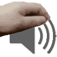
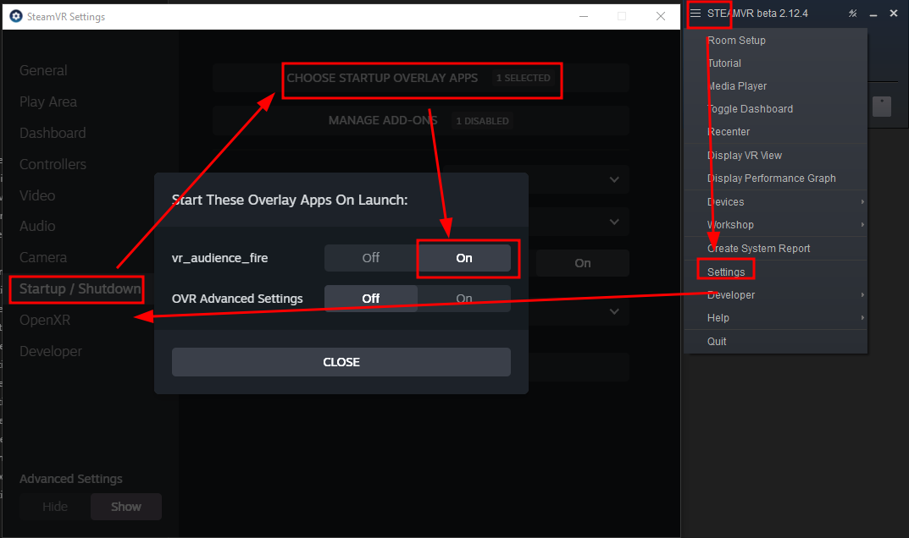

**WORK IN PROGRESS UNTIL END OF 2025, MAY NOT WORK**

# Motion Controlled ASMR Sounds System 

*Experimental hand-motion 🖐 controlled ASMR sounds system for VRChat*
Smoothly fade in and out your petting sounds while moving hands in VR for enhanced meditation/ASMR experiences.

### Marketplace 🛒

 - https://python1320.gumroad.com/l/vr_asmr_petting

### Includes 📦📦📦
 
 - Installation instructions 👉
 - VRCFury prefab 📦
 - Petting sounds 🔊
 - Open source utility application (needed for automatic volume control!) 🛠️

**🛑 NOT YET COMPATIBLE WITH QUEST 🛑**

### How does it work
When both prefab is installed and app is running, the speed of your hand movement is relayed from SteamVR to a helper application, which continuously sends [OSC](https://docs.vrchat.com/docs/osc-overview) messages to VRChat.
The message changes [avatar parameters](https://creators.vrchat.com/avatars/animator-parameters/), which in turn changes the volume/pitch of the petting sound from 0 up to 1. Sound can be enabled/disabled in [action menu](https://docs.vrchat.com/docs/action-menu) (no fading yet).

### Requirements 📓

 - **Your custom avatar** (and source code). Used [example](https://drive.google.com/drive/folders/1ekIiFBnzJNhH2a6wwYLo2s5G-VuUlIY5)
 - **SteamVR** (**NOT YET COMPATIBLE WITH QUEST**)
 - **VR controllers** 
 - **Windows only** *(Author cannot presently run Linux VR due to old PC troubles)*
 - **VRChat** (ChilloutVR should also work, but is not documented and probably no longer needed. Resonite also does not need this addon.)
 - **Knowledge about [OSC](https://docs.vrchat.com/docs/osc-overview)**
 - **[Unity editor](https://creators.vrchat.com/sdk/current-unity-version/)** for avatars 
 - **[VRCFury](https://vrcfury.com/getting-started)**

### HARM REDUCTION 😭

This is a tool, a tool can be used for good or bad (without realizing it), make note of the following:

 1. SOME DO NOT TOLERATE MOVEMENT NEAR THEIR FACE AT ALL  
    (ask for permission first, maybe do not use sounds at first)
    1. (Also, a small minority tolerate only fast (or only slow) hand movement)
 2. SOME GREATLY DISLIKE ASMR SOUNDS (but may also be too timid to say it!)
 3. MANY DISLIKE UNKNOWN PEOPLE APPROACHING THEIR FACE (again, make sure contact is appreciated)
 4. APPROACHING FROM SIDE/BEHIND CAN STARTLE PEOPLE (may appear to be a spider)
 5. MANY OTHER PITFALLS (you have been warned)

For non-verbal initiation, the following flowchart is provided (no warranty):

### Test Avatar 😎

https://vrchat.com/home/avatar/avtr_6f59f68e-989e-42a1-8435-25c26d09a841

### Installation Video 📹

 - [Using VRCFury prefab assets in Unity](https://www.youtube.com/watch?v=QDvzfLa82yI)

### Installation Instructions ℹ️

The steps are mostly the same as here https://morghus.gumroad.com/l/cugahoodie (replace with vr_asmr_petting.unitypackage)

**Unity**

 1. Install Creator Companion and [VRCFury](https://vrcfury.com/getting-started)
 2. Download the unitypackage and import it (or install via creator companion)
 3. TAKE A BACKUP OF YOUR AVATAR HERE
 4. How to import the downloaded `.unitypackage` in Unity: Top Menu: Assets -> Import Package -> Custom Package
 5. Find the prefab from assets or packages, drag the prefab into the scene tree
   - Locate the vrpets directory in the Project tab, within you'll find a "vrpets" object. 
      - Click and drag it onto the main Avatar object in your Hierarchy. It should be a direct child of the object.
	  - Once the prefab has been put in the correct place, it should show up on your avatar in the Scene view.
	  - The package includes a script that will automatically setup sounds to correct hand bones. No manual setup should be necessary.
      - Do not disable the "VRPets Prefab" object itself as the pets will not work properly
 6. Run build and test or republish your avatar
 7. Remember to enable OSC and to regenerate OSC config!

  - VRCFury will automatically add a new [expression menu](https://docs.vrchat.com/docs/action-menu#expression-menu) entry and you will be able to toggle the pets on and off there. Test it in game and see if it works. 

**Helper app 🛠️**
 1. Download the latest `vr_asmr_petting_helper.zip` from [releases](https://github.com/Python1320/vr_asmr_petting/releases)
 2. Extract the ZIP file to somewhere
 3. Launch SteamVR
 4. Run `vr_asmr_petting.exe` once. *If unsure you can run it a second time and it will give an error about already running. If this does not happen the program is somehow crashing.*
 5. The program runs in background. Look in task manager for status.
 6. In case of trouble run `vr_asmr_petting_console.exe` to see debug output. You may also need to set debug to true in `config.json`
 7. Look in [`config.json`](https://github.com/Python1320/vr_asmr_petting/blob/main/src/config.json) for additional settings.
 8. The program quits when SteamVR quits

### What it does NOT do 🛑
 - Does NOT let you experience ASMR, only give it (unless you pet yourself)
 - Does NOT automatically activate (you need to enable/disable it it in menu, there is no gesture yet)
    - Only modulates the volume based on movement
 - Does NOT include models (Though it's easy to add)
 - Does not (yet) have a collection of high quality ASMR petting sounds, [please help expand](https://github.com/Python1320/vr_asmr_petting/issues/22)!
 - Does not (yet) have a guide on how to make your own sound

### TODO 📌

See [github issues](https://github.com/Python1320/vr_asmr_petting/issues?q=is%3Aissue%20state%3Aopen%20label%3Aenhancement%20OR%20label%3Aextra%20OR%20label%3A%22help%20wanted%22%20OR%20label%3Arelease)

### Parameter usage 📋

| **path**                              | **type**  | **synced bits**   |
|---------------------------------------|-----------|-------------------|
| /avatar/parameters/sounds/pets/normal | bool      | 1                 |
| /avatar/parameters/sounds/pets/alt    | bool      | 1 _(optional)_    |
| /avatar/parameters/petting_volume     | float     | 8                 |
| /avatar/parameters/petting_volume_r   | float     | 8                 |
| /avatar/parameters/sounds/cling       | bool      | 1 _(optional)_    |
| /avatar/parameters/sound_taps_right   | bool      | 1 _(optional)_    |
| /avatar/parameters/sound_taps_left    | bool      | 1 _(optional)_    |
|                                       | **TOTAL** | **17 to 21 bits** |

### Troubleshooting 🎯

 1. Ensure you have Avatar Self Interact enabled in the VRChat settings menu: 
 2. [Enable OSC](https://docs.vrchat.com/docs/osc-overview#enabling-it)
 3. Use [OSC Debug](https://docs.vrchat.com/docs/osc-debugging) to see if are receiving any data
 4. Make sure your VRChat SDK is updated in the companion app! VRCFury usually requires the latest VRChat SDK.

The application generates a `debug.log` file on start. This can provide clues on what is wrong.

### How to change the sounds 🖊️

 - Navigate to your hand bones and just replace the sound files with your own

### Related things 🤝

 - [HandSFX](https://booth.pm/en/items/5851561) (Untested!)
 - Community recommendations [here](https://github.com/Python1320/vr_asmr_petting/issues/21)
 - *There is (apparently) a similar behaving prefab or avatar with sound reaction (that probably does not require a helper application), please list it in the above issues!*
 - Similar addons: [ASMR VRChat Prefab](https://fluffyteddy.gumroad.com/l/ASMR), [Dynamic Hairbrush for VRChat avatars](https://iaminvalid.gumroad.com/l/hctbu)
 - Recommended: add distance fading to your model hands either using [Poiyomi Proximity Color](https://www.poiyomi.com/special-fx/proximity-color) or via a [custom standard shader (experimental)](https://github.com/python1320/reroStandard)

### Known Issues 🎯

https://github.com/Python1320/vr_asmr_petting/issues

### Helper app automatic start ℹ️

After launching the helper exe successfully once, you should be able to enable autostart in SteamVR:

### NO SUPPORT NO WARRANTY

This is a hobby for me. Payment does not give personal support! I may or may not have time to look at github issues but that's about it.
No warranty of any kind, this might even hurt your friendships or get you reported for harassment if used wrong! Likely it just refuses to work because I forgot to document something.
*I cannot afford supporting you, and you cannot afford my support, sorry. Feel free to ask someone else to fix things for you!*
